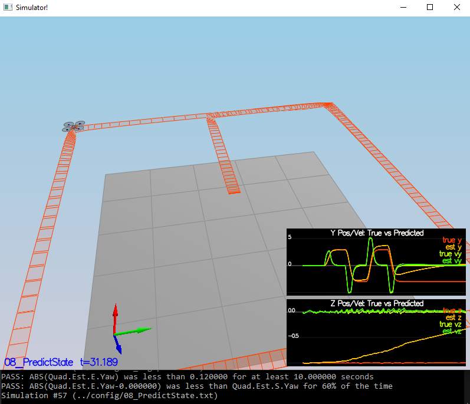
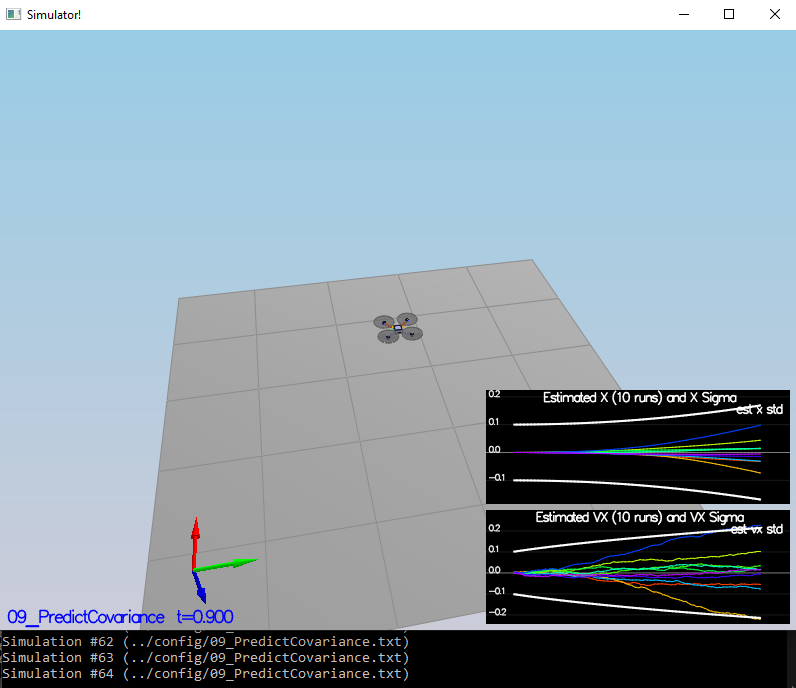
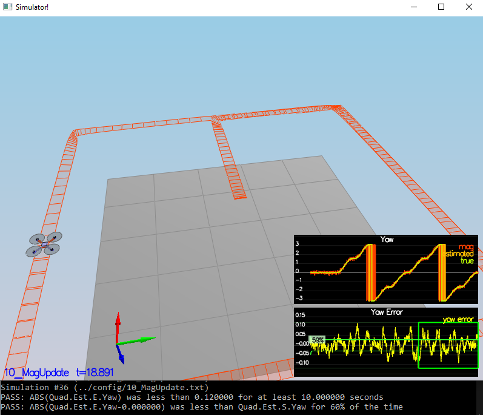
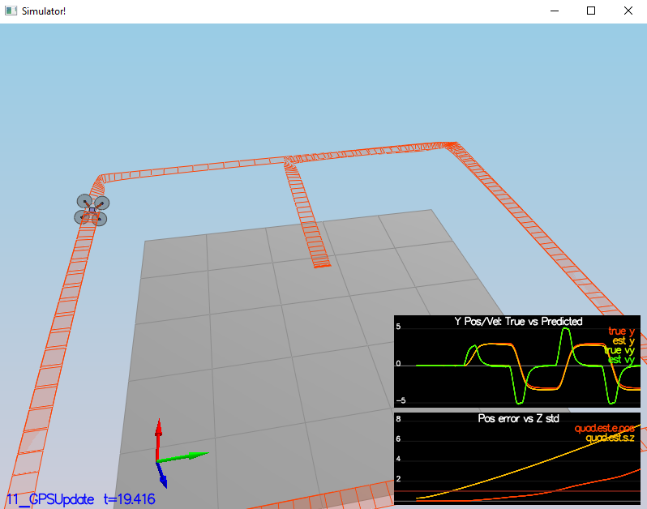
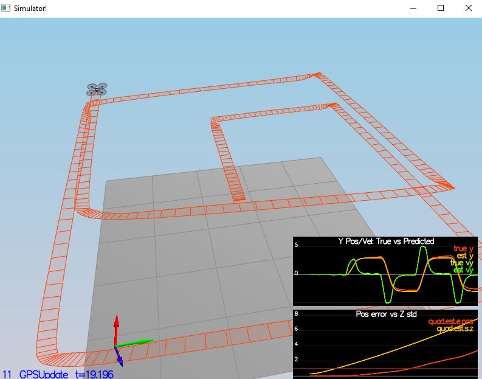
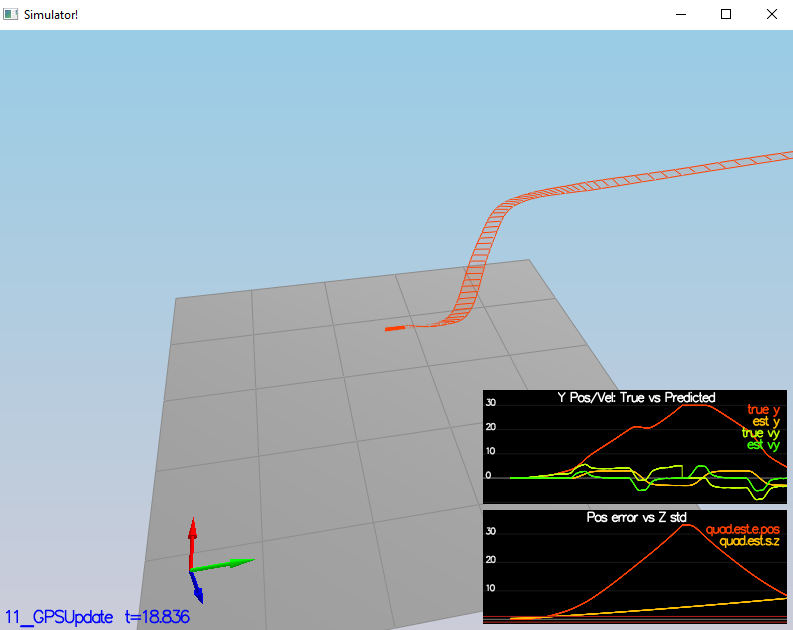
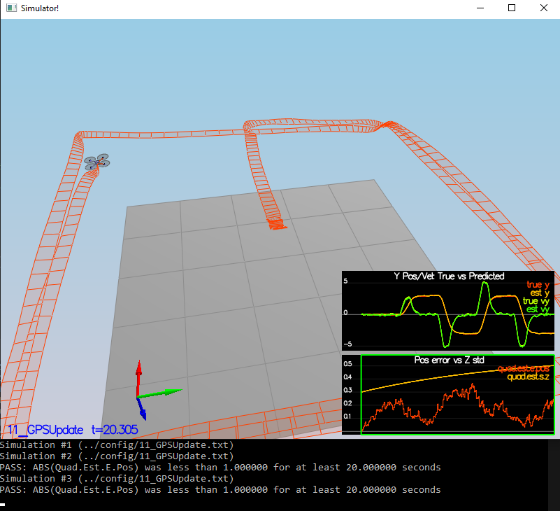
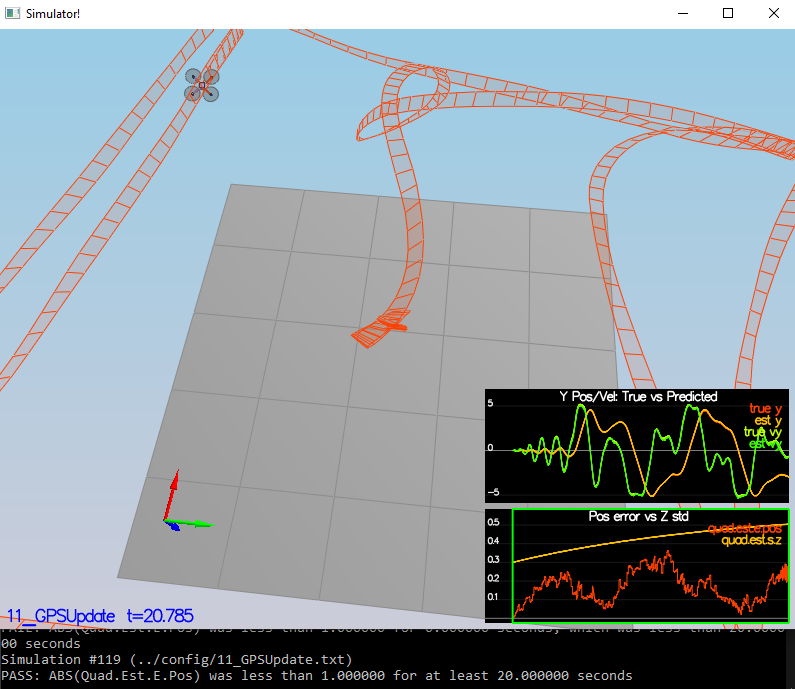

# Step 1: Sensor noise


For the controls project, the simulator was working with a perfect set of sensors, meaning none of the sensors had any noise. The first step to adding additional realism to the problem, and developing an estimator, is adding noise to the quad's sensors. For the first step, you will collect some simulated noisy sensor data and estimate the standard deviation of the quad's sensor.

1. Run the simulator in the same way as you have before

2. Choose scenario `06_NoisySensors`. In this simulation, the interest is to record some sensor data on a static quad, so you will not see the quad move. You will see two plots at the bottom, one for GPS X position and one for The accelerometer's x measurement. The dashed lines are a visualization of a single standard deviation from 0 for each signal. The standard deviations are initially set to arbitrary values (after processing the data in the next step, you will be adjusting these values). If they were set correctly, we should see ~68% of the measurement points fall into the +/- 1 sigma bound. When you run this scenario, the graphs you see will be recorded to the following csv files with headers: `config/log/Graph1.txt` (GPS X data) and `config/log/Graph2.txt` (Accelerometer X data).

3. Process the logged files to figure out the standard deviation of the the GPS X signal and the IMU Accelerometer X signal.

4. Plug in your result into the top of `config/6_Sensornoise.txt`. Specially, set the values for `MeasuredStdDev_GPSPosXY` and `MeasuredStdDev_AccelXY` to be the values you have calculated.

5. Run the simulator. If your values are correct, the dashed lines in the simulation will eventually turn green, indicating you’re capturing approx 68% of the respective measurements (which is what we expect within +/- 1 sigma bound for a Gaussian noise model)


```python
import numpy as np

samples_gpsx = np.loadtxt('config/log/Graph1.txt', delimiter=',', skiprows=1)
samples_imuax = np.loadtxt('config/log/Graph2.txt', delimiter=',', skiprows=1)

std_gpsx = np.cov(samples_gpsx[:, 1])
std_imuax = np.cov(samples_imuax[:, 1])
mean_gpsx = np.cov(samples_gpsx[:, 1])
mean_imuax = np.cov(samples_imuax[:, 1])

print("GPS X: std={}, mean={}".format(np.sqrt(std_gpsx), mean_gpsx))
print("IMU accelerometer X: std={}, mean={}".format(np.sqrt(std_imuax), mean_imuax))
```

    GPS X: std=0.000528696698182157, mean=2.795201986687148e-07
    IMU accelerometer X: std=0.0017351846620956343, mean=3.0108658115719404e-06
    

# Step 2: Attitude Stimation

Now let's look at the first step to our state estimation: including information from our IMU. In this step, you will be improving the complementary filter-type attitude filter with a better rate gyro attitude integration scheme.

1. Run scenario `07_AttitudeEstimation`. For this simulation, the only sensor used is the IMU and noise levels are set to 0 (see `config/07_AttitudeEstimation.txt` for all the settings for this simulation). There are two plots visible in this simulation.
The top graph is showing errors in each of the estimated Euler angles.
The bottom shows the true Euler angles and the estimates. Observe that there’s quite a bit of error in attitude estimation.

2. In `QuadEstimatorEKF.cpp`, you will see the function `UpdateFromIMU()` contains a complementary filter-type attitude filter. To reduce the errors in the estimated attitude (Euler Angles), implement a better rate gyro attitude integration scheme. You should be able to reduce the attitude errors to get within 0.1 rad for each of the Euler angles, as shown in the screenshot below.

In the function `UpdateFromIMU()` is used a complementary filter which is only valid for small values of roll and pitch angles. To improve this complementary filter i have used a quaternion to convert the angle rates in the body frame into the euler angles in the inercial frame.

```cpp
Quaternion<float> quaternion = Quaternion<float>::FromEuler123_RPY(rollEst, pitchEst, ekfState(6));
quaternion.IntegrateBodyRate(gyro, dtIMU);
float predictedRoll = quaternion.Roll();
float predictedPitch = quaternion.Pitch();
ekfState(6) = quaternion.Yaw();
```

# Step 3: Predicion Step

In this next step you will be implementing the prediction step of your filter.

1. Run scenario `08_PredictState`. This scenario is configured to use a perfect IMU (only an IMU). Due to the sensitivity of double-integration to attitude errors, we've made the accelerometer update very insignificant (`QuadEstimatorEKF.attitudeTau = 100`). The plots on this simulation show element of your estimated state and that of the true state. At the moment you should see that your estimated state does not follow the true state.

2. In `QuadEstimatorEKF.cpp`, implement the state prediction step in the `PredictState()` function. If you do it correctly, when you run scenario `08_PredictState` you should see the estimator state track the actual state, with only reasonably slow drift.

The implemented code and the result of the test can be seen below:
```cpp
  ////////////////////////////// BEGIN STUDENT CODE ///////////////////////////
  // transform acceleration from body frame to intertial frame
  V3F accel_i = attitude.Rotate_BtoI(accel);
  accel_i.z = accel_i.z - CONST_GRAVITY; // add the gravity acceleration to the value of the accelerometer
  
  predictedState(0) = curState(0) + curState(3) * dt; // x + x_dot * dt
  predictedState(1) = curState(1) + curState(4) * dt; // y + y_dot * dt
  predictedState(2) = curState(2) + curState(5) * dt; // z + z_dot * dt
  predictedState(3) = curState(3) + accel_i.x  * dt; // x_dot + x_dot_dot * dt
  predictedState(4) = curState(4) + accel_i.y * dt; // y_dot + y_dot_dot * dt
  predictedState(5) = curState(5) + accel_i.z * dt; // z_dot + z_dot_dot * dt
  predictedState(6) = curState(6); // already calculated in UpdateFromIMU()
  /////////////////////////////// END STUDENT CODE ////////////////////////////
```


3. Now let's introduce a realistic IMU, one with noise. Run scenario `09_PredictionCov`. You will see a small fleet of quadcopter all using your prediction code to integrate forward. You will see two plots:
The top graph shows 10 (prediction-only) position X estimates
The bottom graph shows 10 (prediction-only) velocity estimates You will notice however that the estimated covariance (white bounds) currently do not capture the growing errors.

4. In `QuadEstimatorEKF.cpp`, calculate the partial derivative of the body-to-global rotation matrix in the function `GetRbgPrime()`. Once you have that function implement, implement the rest of the prediction step (predict the state covariance forward) in `Predict()`.

The modifications in the function `GetRbgPrime()`.
```cpp
  ////////////////////////////// BEGIN STUDENT CODE ///////////////////////////
  // roll=phi, theta=pitch, psi=yaw
  RbgPrime(0, 0) = -cos(pitch) * sin(yaw);
  RbgPrime(0, 1) = -sin(roll) * sin(pitch) * sin(yaw) - cos(roll) * cos(yaw);
  RbgPrime(0, 2) = -cos(roll) * sin(pitch) * sin(yaw) + sin(roll) * cos(yaw);
  RbgPrime(1, 0) = cos(pitch) * cos(yaw);
  RbgPrime(1, 1) = sin(roll) * sin(pitch) * cos(yaw) - cos(roll) * sin(yaw);
  RbgPrime(1, 2) = cos(roll) * sin(pitch) * cos(yaw) + sin(roll) * sin(yaw);

  /////////////////////////////// END STUDENT CODE ////////////////////////////
```

And in the function `Predict()`.
```cpp
  ////////////////////////////// BEGIN STUDENT CODE ///////////////////////////
  // get gPrime as shown in 7.2 point of the paper
  gPrime(0, 3) = dt;
  gPrime(1, 4) = dt;
  gPrime(2, 5) = dt;
  gPrime(3, 6) = (RbgPrime(0, 0) * accel.x + RbgPrime(0, 1) * accel.y + RbgPrime(0, 2) * accel.z) * dt;
  gPrime(4, 6) = (RbgPrime(1, 0) * accel.x + RbgPrime(1, 1) * accel.y + RbgPrime(1, 2) * accel.z) * dt;
  gPrime(5, 6) = (RbgPrime(2, 0) * accel.x + RbgPrime(2, 1) * accel.y + RbgPrime(2, 2) * accel.z) * dt;

  // create the new coviarance
  ekfCov = gPrime * ekfCov * gPrime.transpose() + Q; // G_t * COV_t-1 * G_t^T + Q
  /////////////////////////////// END STUDENT CODE ////////////////////////////
```

5. Run your covariance prediction and tune the `QPosXYStd` and the `QVelXYStd` process parameters in `QuadEstimatorEKF.txt to try to capture the magnitude of the error you see. Note that as error grows our simplified model will not capture the real error dynamics (for example, specifically, coming from attitude errors), therefore try to make it look reasonable only for a relatively short prediction period (the scenario is set for one second).

The tuned values are the following:
```pyhton
QPosXYStd = .03  #05
QPosZStd = .05
QVelXYStd = .2 #.05
QVelZStd = .1
QYawStd = .09 #.05
```

The result of the test is shown in the image below:


# Step 4: Magnetomer Update

Up until now we've only used the accelerometer and gyro for our state estimation. In this step, you will be adding the information from the magnetometer to improve your filter's performance in estimating the vehicle's heading.

1. Run scenario `10_MagUpdate`. This scenario uses a realistic IMU, but the magnetometer update hasn’t been implemented yet. As a result, you will notice that the estimate yaw is drifting away from the real value (and the estimated standard deviation is also increasing). Note that in this case the plot is showing you the estimated yaw error (`quad.est.e.yaw`), which is drifting away from zero as the simulation runs. You should also see the estimated standard deviation of that state (white boundary) is also increasing.

2. Tune the parameter `QYawStd` (`QuadEstimatorEKF.txt`) for the QuadEstimatorEKF so that it approximately captures the magnitude of the drift, as demonstrated here:

The tuned parameters are the following:
```python
QYawStd = .09 #.05
```

3. Implement magnetometer update in the function `UpdateFromMag()`.

```cpp
  ////////////////////////////// BEGIN STUDENT CODE ///////////////////////////
  // create h_prime matrix from 7.3.2 paper
  // z -> z_t = [ psi ]
  hPrime(0, 6) = 1;   // h_prime(x_t) = [ 0 0 0 0 0 0 1 ]
  zFromX(0) = ekfState(6); // h(x_t) = [ x_tpsi ]

  // check the difference is inside the interval [-pi, +pi]
  if ( (z(0) - zFromX(0)) > F_PI ) zFromX(0) += 2.f * F_PI;
  if ( (z(0) - zFromX(0)) < -F_PI) zFromX(0) -= 2.f * F_PI;

  /////////////////////////////// END STUDENT CODE ////////////////////////////
```

The result of the test is shown below:


# Step 5: Closed Loop + GPS update

1. Run scenario `11_GPSUpdate`. At the moment this scenario is using both an ideal estimator and and ideal IMU. Even with these ideal elements, watch the position and velocity errors (bottom right). As you see they are drifting away, since GPS update is not yet implemented.

As it can be seen in the image below the position has small drift but the track is followed well.


2. Let's change to using your estimator by setting `Quad.UseIdealEstimator` to 0 in `config/11_GPSUpdate.txt`. Rerun the scenario to get an idea of how well your estimator work with an ideal IMU.

Without ideal estimator the drift is big and the quad the quad more or less follows the route in the XY coordinates but the altitude increases continuously.


3. Now repeat with realistic IMU by commenting out these lines in `config/11_GPSUpdate.txt`:
```python
#SimIMU.AccelStd = 0,0,0
#SimIMU.GyroStd = 0,0,0
```


The drift is too big that the quad can't follow the route.


4. Tune the process noise model in `QuadEstimatorEKF.txt` to try to approximately capture the error you see with the estimated uncertainty (standard deviation) of the filter.

The tuned settings are as shown below.
```python
# GPS measurement std deviations
GPSPosXYStd = 1
GPSPosZStd = 10 #3
GPSVelXYStd = .1
GPSVelZStd = .3

```

5. Implement the EKF GPS Update in the function `UpdateFromGPS()`.

The code implementation is shown below:
```cpp
////////////////////////////// BEGIN STUDENT CODE ///////////////////////////
// create h_prime matrix from 7.3.1 paper
// z -> z_t = [ x y z x_dot y_dot z_dot ]
// h_prime(x_t) = [ [1 0 0 0 0 0], [0 1 0 0 0 0], [0 0 1 0 0 0], [0 0 0 1 0 0], [0 0 0 0 1 0], [0 0 0 0 0 1] ]
// h(x_t) = [ x_tx x_ty x_tz xt_tx' x_txdot x_tydot x_tzdot ]
int i;
for (i = 0; i < 6; i++) {
  hPrime(i, i) = 1;
  zFromX(i) = ekfState(i);
}
/////////////////////////////// END STUDENT CODE ////////////////////////////
```

6. Now once again re-run the simulation. Your objective is to complete the entire simulation cycle with estimated position error of < 1m (you’ll see a green box over the bottom graph if you succeed). You may want to try experimenting with the GPS update parameters to try and get better performance.

The result of the test can be seen in the following image.


# Step 6: Adding your controller

Up to this point, we have been working with a controller that has been relaxed to work with an estimated state instead of a real state. So now, you will see how well your controller performs and de-tune your controller accordingly.

1. Replace `QuadController.cpp` with the controller you wrote in the last project.

2. Replace `QuadControlParams.txt` with the control parameters you came up with in the last project.

3. Run scenario `11_GPSUpdate`. If your controller crashes immediately do not panic. Flying from an estimated state (even with ideal sensors) is very different from flying with ideal pose. You may need to de-tune your controller. Decrease the position and velocity gains (we’ve seen about 30% detuning being effective) to stabilize it. Your goal is to once again complete the entire simulation cycle with an estimated position error of < 1m.

To achieve pass the test I reduced the position and velocity gains to the 30% of the original value. The result of test can be seen below:



```python

```
